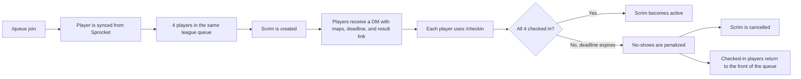
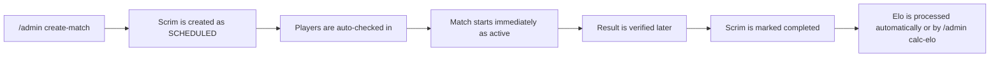

# How The Bot Works

This guide is for players, scrim admins, and league admins who need to understand the full flow of the bot without reading the source.

At a high level, the bot runs two kinds of match flows:

- Queue scrims, where 4 players from the same league are pulled from the live queue.
- Scheduled league matches, where an admin creates a match directly.

## Queue Scrim Lifecycle

### 1. A player joins the queue

The player runs `/queue join`. The bot does not ask them to choose a league manually. Instead, it looks up the Discord account in Sprocket, confirms the player has a supported Trackmania profile, and places them into the correct league queue.

If the player is banned, the bot refuses the join and tells them how long is left on the ban.

If the player is not registered in Sprocket, the bot tells them to register there first and contact an admin if they still cannot queue.

### 2. The queue pops

When 4 players are available in the same league, the bot creates a scrim and selects 3 maps from the least-played pool for those players. The scrim starts in `checking_in` status with a 5-minute deadline by default.

Each player gets a DM with:

- The scrim ID
- The league
- The other players
- The map list
- The check-in deadline
- A link to the Apps Script result-submission page

If configured, the bot also posts the same scrim embed in a league channel.

### 3. Players check in

Each player runs `/checkin` while the scrim is still in the check-in window.

What they see depends on the state of the match:

- If they were already checked in, the bot tells them so.
- If they are late, the bot tells them the window expired.
- If they are the final player to check in, the scrim becomes `active`.
- If some players are still missing, the bot confirms their check-in and waits.

### 4. The timeout path

If the check-in deadline passes before everyone confirms, the bot handles the match automatically:

- No-show players receive a dodge penalty.
- The scrim is cancelled.
- Players who did check in are returned to the front of their league queue.

That return-to-front behavior matters operationally. It means the players who showed up are not thrown back into the normal queue order behind everyone else.

### 5. After the match

Once the match is finished, the downstream parser or verifier is expected to mark the scrim completed and set the winner information in the database. The bot watches for completed scrims with a winner set and processes Elo automatically.

That check runs in the background, so Elo usually happens without manual intervention once the result is recorded.

If Elo needs to be run manually, an admin can also trigger it with `/admin calc-elo`.

## Scheduled League Match Lifecycle

Scheduled matches are for admin-run matchups where you already know the 4 players.

### When to use this flow

Use `/admin create-match` when you want to schedule a league match directly instead of waiting for the live queue to form naturally. The command requires 4 registered players and a league selection.

The bot creates the scrim in `active` status and marks all 4 players as checked in immediately. There is no 5-minute check-in window for this flow.

### What admins should expect

- The scrim is stored with `match_type=SCHEDULED`.
- The players are already marked as present.
- The match can be verified and completed later by the normal result workflow.
- Elo is processed the same way once the scrim is completed and has a winner set.

## Admin Operations

The admin command group is the control panel for queue resets, bans, stats, and match administration.

### `/admin queue-reset`

Use this when a queue needs to be cleared because of a bad state, an incident, or a test cleanup.

Examples:

- Reset one league queue when only that league is affected.
- Reset all queues if you need a full clean slate.

### `/admin ban`

Use this to manually remove a player from queueing for a fixed duration.

Typical cases:

- Rule enforcement
- Tournament admin decisions
- Temporary moderation after repeated disruption

### `/admin unban`

Use this when a ban should be removed early. The command clears active bans for that player.

### `/admin stats`

Use this to inspect a player before making moderation or support decisions. It shows:

- League
- Current ban state
- Recent dodge count
- Recent bans

### `/admin dodges`

Use this when you only need the dodge history, not the rest of the moderation context.

### `/admin create-match`

Use this to create a scheduled match with 4 specific players in a league.

### `/admin calc-elo`

Use this when a completed scrim needs Elo processing now instead of waiting for the background poller.

The command only works when:

- The scrim exists
- The scrim is marked completed
- The scrim has a winner set
- Elo has not already been processed

## Common Day-Of-Event Checklist

If you are running a league session, the usual sequence is:

1. Check queue health with `/queue status`.
2. Watch for the queue pop DM or channel post.
3. Confirm players check in within the time limit.
4. Make sure completed matches get verified.
5. Trigger `/admin calc-elo` only if automatic Elo has not already run.

## Quick Mental Model

If you only remember one thing, remember this:

- Queue scrims are born from `/queue join`.
- Scheduled matches are born from `/admin create-match`.
- `checking_in` means the match is waiting on players.
- `active` means the match is live.
- `completed` means result processing can happen.
- `cancelled` means the check-in window failed and the match was abandoned.
